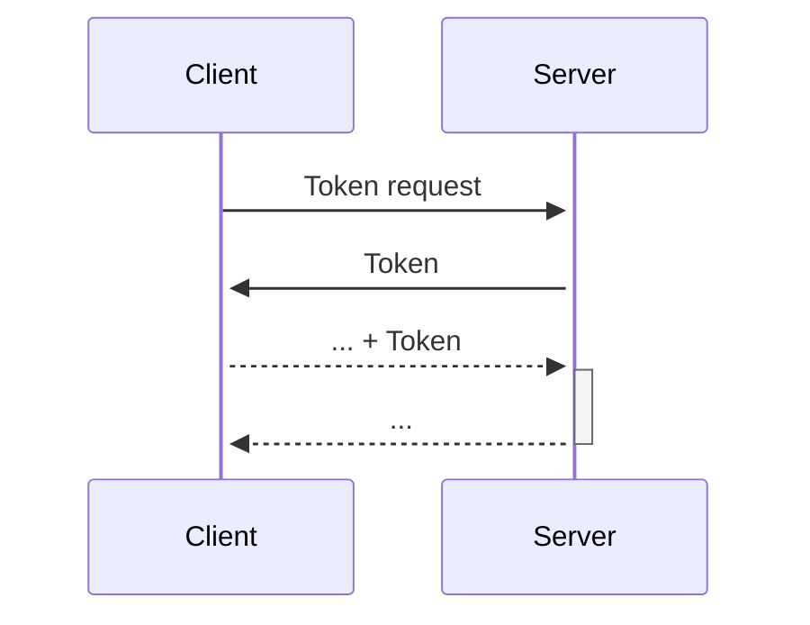
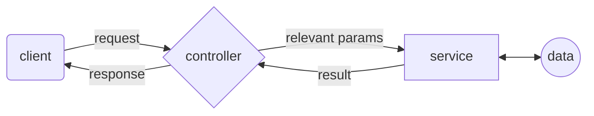

# Chat Application

This repository provides an online chat application client built on React, and a web service built on Node.js and Express.js.

## Getting Started

### Dependencies

This project requires the following dependencies:

* [Node.js](https://nodejs.org/en/) - JavaScript runtime environment
* [npm](https://www.npmjs.com/) - Package manager for JavaScript
* [React](https://reactjs.org/) - JavaScript library for building user interfaces
* [MongoDB](https://www.mongodb.com/) - NoSQL database

### Installation

Clone the repository: 
```bash
git clone https://github.com/JonathanMoiseyev/ap2-a4
```

Download the necessary dependencies for both the web-client and the server, by running 

```
npm i --force
```

in both the web-client and the server directories.

### Executing The Program

To run the server, navigate to the server directory, and run the following command:

```bash
node app.js
```

To run the web client, run the following command in the web client directory:

```bash
npm start
```

then open [http://localhost:3000](http://localhost:3000) 
to view it in your browser.

To run the android client, open the android studio app on the android client folder. make sure that your android sdk has a correct config, and run it from there (of course you can run it both on an emulator, a phisycal device).

## Design

### Web Client workflow

The client is built on React. It is responsible for displaying the user interface, and communicating with the server.

There is one thing to note about the client's workflow. When a user logs in, the server returns a JWT token. The client then stores this token in local storage, and uses this token to authenticate the user in every request to the server. When the user logs out, the client deletes the token from the local storage.



### Android Client workflow

The android client is very similar to the web client. The only difference is that the android client uses Firebase to receive notifications from the server, instead of web sockets. 

Also, in the android client we intreduce two new abilities:

* Changing the server address.
* Changing the default applicaiton theme (eg. dark mode).

These changes can be made from the settings menu. 


### Server API

The server is built on Node.js and Express.js. It's responsible for handling the client's requests, and communicating with the database.

The server exposes it's functionality through a REST API. Here's a list of the API's endpoints:

| Endpoint | Method | Description |
|----------|--------|-------------|
| /api/Tokens | POST | Returns a JWT token for the user |
| /api/Users | POST | Registers a new user |
| /api/Users/:username | GET | Returns the user's information |
| /api/Chats | GET | Returns all the chats the user is a part of |
| /api/Chats | POST | Creates a new chat |
| /api/Chats/:id | GET | Returns a chat's information |
| /api/Chats/:id | DELETE | Deletes a chat |
| /api/Chats/:id/Message | POST | Sends a message in a chat |
| /api/Chats/:id/Message | GET | Returns all the messages in a chat |

**Note:** besides the first two endpoints, all the other endpoints require the user to be authenticated. The authentication is done by sending the JWT token in the request's header.

### Server Architecture

The server is designed using the MVCS architecture (except for the view, since there is no user interface). Here's a simple diagram of the server's architecture:



### Web Sockets

In order to get real time updates, the server uses web sockets to notify the client when a new message is sent in a chat. The client then updates the chat's messages.

### Firebase

Similiary to the web sockets, the server uses Firebase to notify the android client when new activities occur - making it push new notifications to the user. 


### Notes

- When a user  (say, _user a_) adds another contact (say, _user b_), _user b_ **appears** in _user a's_ contact list. Yet, _user a_ **does not appear** in _user b`s_ contact list, until _user a_ sends _user b_ a message. This is our **intended** functionality as whatsapp behaves similarly. 

-  In order to help the server identify which client the user's using (so the server will know whether to send a web socket or a firebase notification), at login, the android client sends a flag to the server. This mean that one can't use the android client and the web client at the same time.

- When opening the app, it's important to allow it to send notifications - otherwise the client won't show any updates. Furthermore, we rocommend allowing this functionality in advance.

- The android client supports english, textual messages only (only ascii charachters)

- The message date times show up with times from the GMT time zone

- **Imortant:** Since we are using the free tiers of Firebase and MongoDB, the application only supports very small images - preferably around 222 bytes.


## Authors
[Jonathan Kelsi](https://github.com/JonathanKelsi)  
[Jonathan Moiseyev](https://github.com/JonathanMoiseyev)  
[Yuval Grofman](https://github.com/yuvalgrofman)
